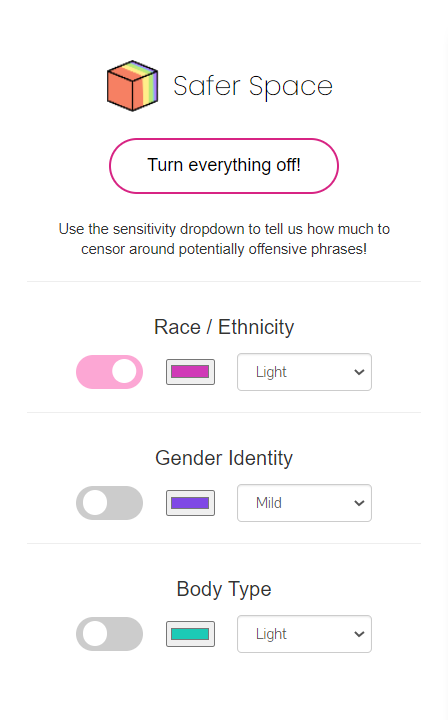

# Safer Space

A Chrome extension created for Quellie Hacks 2021
Check out our submission [here](https://devpost.com/software/safer-space)!  

## What is Safer Space?
* Safer Space is a Chrome extension that helps you browse the internet while blurring out potentially triggering content!
* Different types of content can be blurred in different colours to warn you about what comes next!
* Used the [Hate_speech](https://huggingface.co/datasets/viewer/?dataset=hate_speech18) dataset to identify potentially discriminatory phrases 

## How do I use Safer Space? 
* Toggle the on/off button for each type of content 
* Customize each category with a blur colour and a sensitivity level
* Hover over blurred text to read content

## What did we use?
* JavaScript
* HTML
* CSS & Bootstrap
* Python
* Flask
* NLTK
* Ajax
* JQuery
* Chrome's storage API 

## What comes next?
* Increase the accuracy of the identification model using a larger and more diverse set of data.
* Implement a system where users can give feedback to improve the accuracy of the extension.

## Contributors 
* [Jamie Tsai](https://github.com/JamieTsai1024)
* [Danny Zhang](https://github.com/DannyZhang686)
* [Jenny Zhang](https://github.com/j3nny-zhang)